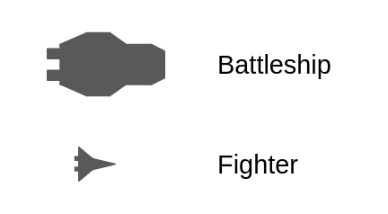
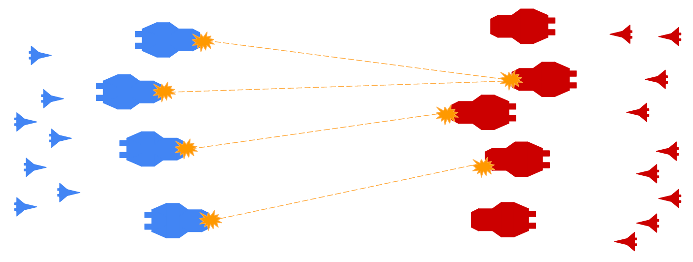
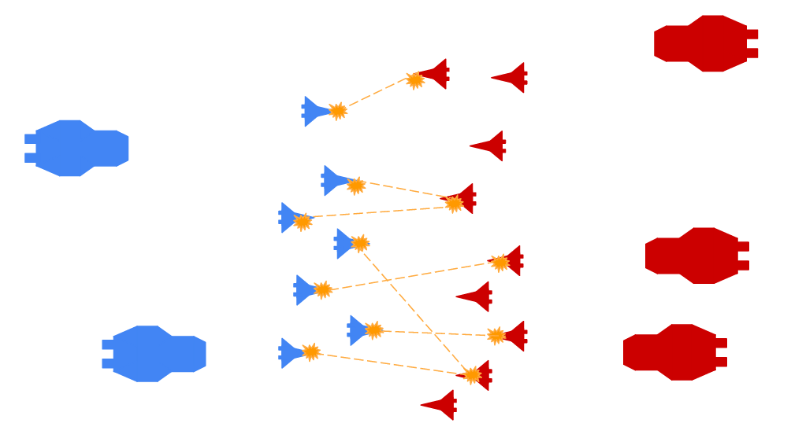
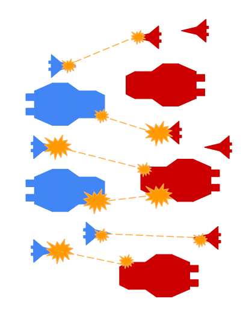

# Full battle simulator

## Instructions

Reuse all previous files (`battle_simulator.py`, `spaceships.py`, `fleet.py` and `base_spaceships.py`). In `Simulator` class, add a constructor and create 2 methods: `fight` and `get_report`.

**Specifications:**

* the `Simulator` constructor should take 2 parameters: 
  * the attacker fleet (a `Fleet` class instance)
  * the defender fleet
* the `fight` method:
  * does not accept any parameters
  * returns noting
  * simulate a whole battle (see bellow)
* `get_report` build final simulation report as dictionary. It should return a dictionary with 2 entries (one per fleet):

```python
{
  '[attacker fleet name]': {
    'alive_battleships': 0,
    'alive_fighters': 0,
    'dead_battleships': 0,
    'dead_fighters': 0,
  },
  '[defender fleet name]': {
    'alive_battleships': 0,
    'alive_fighters': 0,
    'dead_battleships': 0,
    'dead_fighters': 0,
  },
}
```

There are 3 steps in a battle:



* **Step 1:** battleships vs battleships



* **Step 2:** fighters vs fighters



* **Step 3:** all surviving fighters and battleships



Your `fight` method should implement those steps correctly.

**Tips**

* Use both previous private methods to simulate each step.
* Use `Feet.get_report` method to build final simulation report


## Usage

Here is a possible `test.py` to test your functions:

```python
import random
from battle_simulator import Simulator
from spaceships import Interceptor, Frigate, Bomber, Destroyer
from fleet import Fleet

if __name__ == '__main__':
    random.seed(100)

    attackers = Fleet('Empire', [Interceptor(), Interceptor(), Frigate()])
    defenders = Fleet('Rebels', [Bomber(), Interceptor(), Destroyer()])

    simulator = Simulator(attackers, defenders)

    simulator.fight()
    print(attackers.ships[0].is_alive)
    print(attackers.ships[1].is_alive)
    print(attackers.ships[2].is_alive)
    print(defenders.ships[0].is_alive)
    print(defenders.ships[1].is_alive)
    print(defenders.ships[2].is_alive)
```

```bash
$ python test.py
True
False
True
True
False
True
{'Empire': {'alive_battleships': 1, 'alive_fighters': 1, 'dead_battleships': 0, 'dead_fighters': 1}, 'Rebels': {'alive_battleships': 1, 'alive_fighters': 1, 'dead_battleships': 0, 'dead_fighters': 1}}
```
